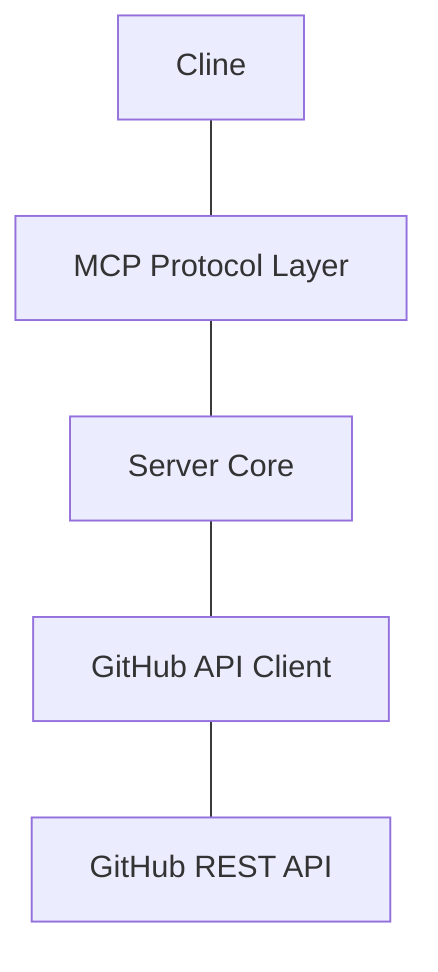
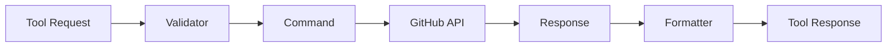
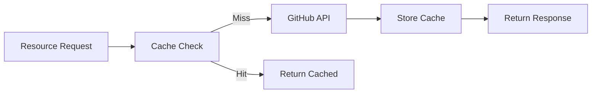

# System Patterns

## Architecture Overview


## Core Components

### 1. MCP Protocol Layer
- Handles communication with Cline
- Implements MCP server protocol
- Exposes tools and resources
- Manages request/response lifecycle

### 2. Server Core
- Central coordination layer
- Authentication management
- Error handling and logging
- Request validation

### 3. GitHub API Client
- GitHub REST API interaction
- Rate limiting management
- Response parsing
- Error translation

## Design Patterns

### 1. Command Pattern
- Each GitHub operation encapsulated as a command
- Standardized execution flow
- Consistent error handling
```python
class IssueCommand:
    def execute(self):
        pass
```

### 2. Factory Pattern
- Tool and resource creation
- Command instantiation
- Response formatting
```python
class ToolFactory:
    def create_tool(self, name: str):
        pass
```

### 3. Strategy Pattern
- Authentication strategies
- Response formatting
- Rate limiting approaches
```python
class AuthStrategy:
    def authenticate(self):
        pass
```

## Component Relationships

### Tool Implementation


### Resource Implementation


## Error Handling
- Hierarchical error types
- Consistent error translation
- Clear error messages
- Rate limit handling

## Data Flow
1. Request received through MCP
2. Request validated
3. Command created and executed
4. Response formatted
5. Response returned through MCP

## Security Patterns
- Credential encryption
- Token-based authentication
- Secure storage practices
- Request validation

## Testing Patterns
- Unit tests per component
- Integration tests for GitHub API
- Mock MCP client for testing
- Error scenario coverage
